# CondoGate: Condo Package & Resident Room Management System

**CondoGate** is a web-based tracking and management application designed to centralize package registration, tenant-room assignments, and status history logs. It aims to reduce lost-package incidents and improve transparency between condominium staff and residents.

---

## Team Members
 
This project was developed by the following team members:
 
- **May Thu Chit (6715141)**  
  GitHub: [MThuChit](https://github.com/MThuChit)
 
- **Aung Sann Thit(6712111)**  
  GitHub: [AungSannThit2000](https://github.com/AungSannThit2000)
 
- **Aung Chan Myint (6715111)**  
  GitHub: [Gebu19](https://github.com/Gebu19)

---

## 🚀 Project Overview
### Problem Statement
Manual tracking methods like paper logs or spreadsheets often lead to missing records, unclear pickup status, and disputes. 

### The Solution
The system provides a central hub for staff to register incoming packages and for tenants to confirm their package status at any time.

### Target Users
* **Officer/Staff**: Register incoming packages, update status and notes, and search records.
* **Tenant**: View personal packages and status history.
* **Admin**: Manage buildings, rooms, and user accounts.

---

## 🛠️ Technology Stack
* **Frontend**: Next.js 
* **Backend**: Next.js REST API (API Routes) 
* **Database**: MongoDB (Self-hosted) 

---

## ✨ Core Features
* **Role-Based Access Control**: Secure login for TENANT, OFFICER, and ADMIN roles.
* **Package Management**: Record incoming packages with tracking numbers, carriers, and notes.
* **Status Tracking & Logs**: Maintain a complete audit trail of all status updates.
* **Room & Building Management**: Create and update buildings and individual room availability.
* **Search & Filter**: Find records by date, status, tenant, or tracking number.

---

## 📊 Data Models
The system implements REST API CRUD operations for the following entities:

| Entity | Primary Fields |
| :--- | :--- |
| **USER_ACCOUNT** | username, password, role, status, createdAt  |
| **TENANT** | userId, buildingId, roomNo, fullName, phone, email  |
| **STAFF** | userId, fullName, phone, email  |
| **BUILDING** | buildingCode, buildingName  |
| **ROOM** | buildingId, roomNo, floor, status  |
| **PACKAGE** | tenantId, receivedByStaffId, trackingNo, carrier, arrivedAt, currentStatus, note, pickedUpAt  |
| **PACKAGE_STATUS_LOG** | packageId, updatedByStaffId, status, note, statusTime  |

---

## 🖥️ System Interface

### 🔐 Authentication
**Login Page**
Centralized entry point for all user roles.
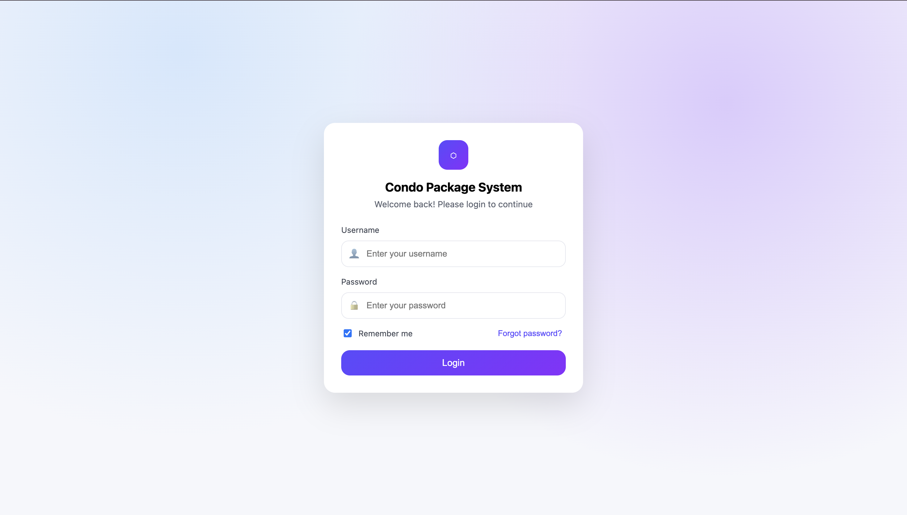

---

## 🏠 1. Tenant Experience
The Tenant role provides residents with a personal dashboard to monitor deliveries and manage their condo contact details securely.

### 🔑 Key Features
* **Live Dashboard:** View immediate statistics on packages waiting at the counter, total picked up this month, and any returned items.
* **Detailed Package History:** Access a searchable log of all past deliveries, including tracking numbers, carrier information (e.g., DHL, FedEx), and specific arrival/pickup timestamps.
* **Transparent Status Logs:** View specific audit trails for each package to see exactly when and by which officer a status was updated.
* **Profile Management:** Maintain up-to-date contact information, including phone number and email, linked directly to their building and unit.

### 📸 Tenant Interface

**Dashboard & Latest Arrivals**
Check real-time delivery status and arrival times at a glance.
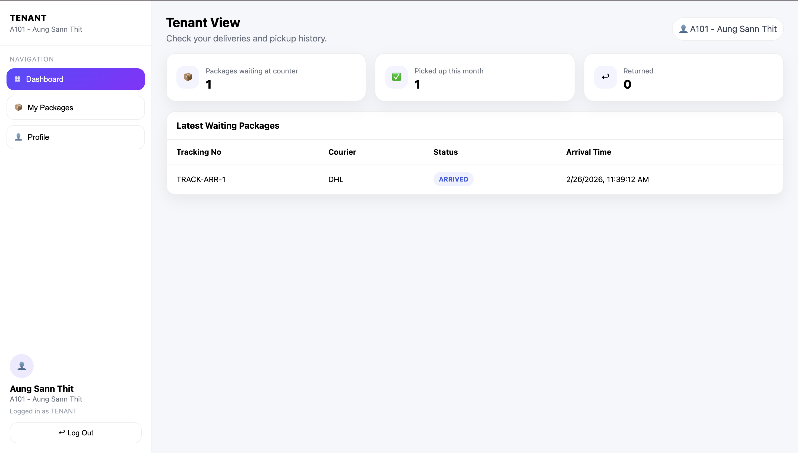

**Package History & Audit Logs**
Browse the full history of received packages and view detailed status logs for each item.
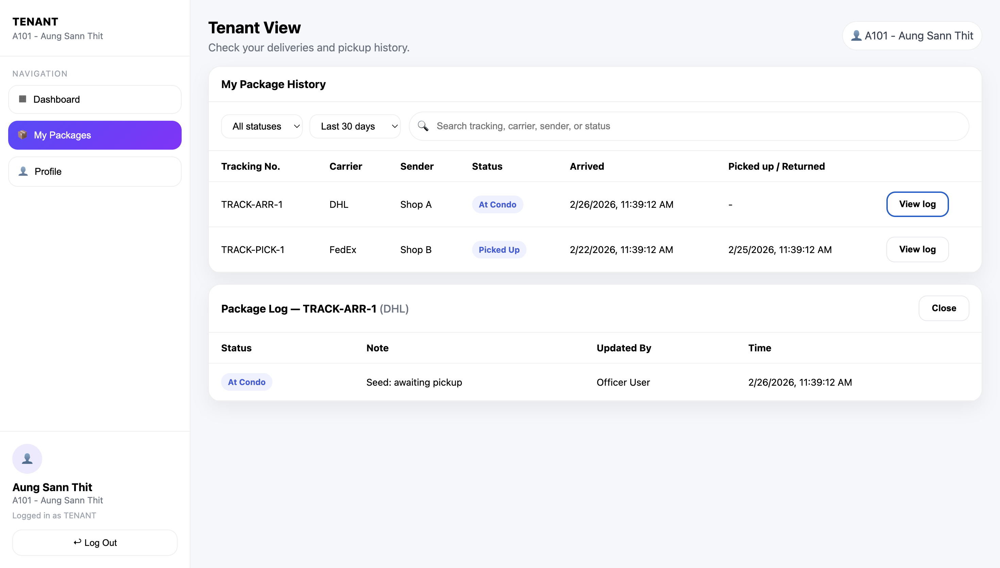

**Personal Profile**
Manage resident contact details and view assigned building/room information.
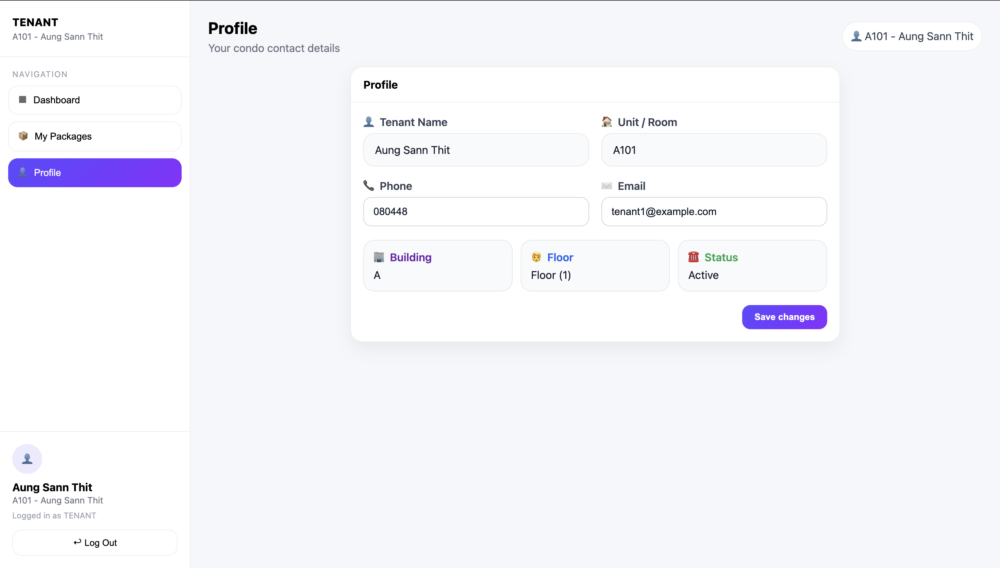
---

## 👮 2. Officer Operations
The Officer role is the core of the condominium’s daily logistics, providing the juristic staff with tools to manage the high volume of incoming parcels and resident pickups efficiently.

### 🔑 Key Features
* **Operational Dashboard:** Real-time tracking of packages currently at the condo, items picked up today, and a monthly tally of returned parcels.
* **Streamlined Registration:** A dedicated interface to log new arrivals, including tracking numbers, courier selection, unit assignment, and custom officer notes (e.g., "Fragile" or "Perishable").
* **Comprehensive Activity Log:** A master view of every package update across the entire condo, searchable by status, date, or unit number.
* **Audit Transparency:** Every status change is timestamped and tagged with the specific officer who performed the update to ensure accountability.

### 📸 Officer Interface
**Officer Dashboard**
Manage the daily workflow with quick-stat cards and a searchable list of current packages.
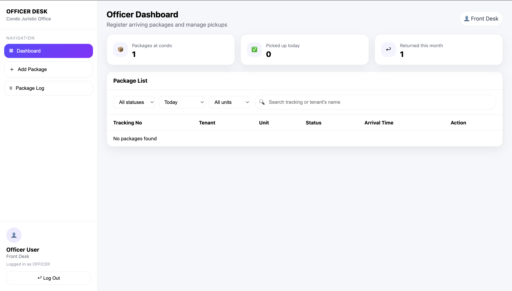

**Register New Package**
Log incoming deliveries quickly with automated timestamps and tenant linking.
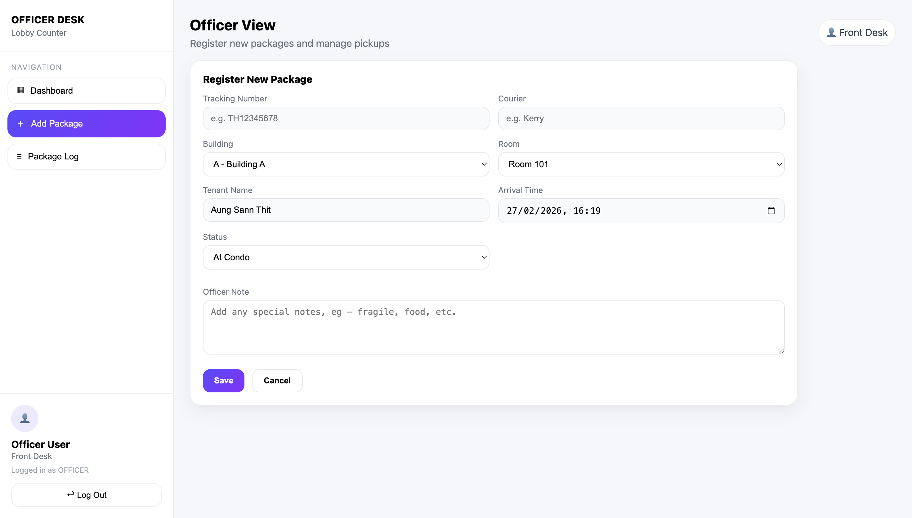

**Master Package Activity Log**
Monitor all historical updates, returns, and pickups across the entire property.
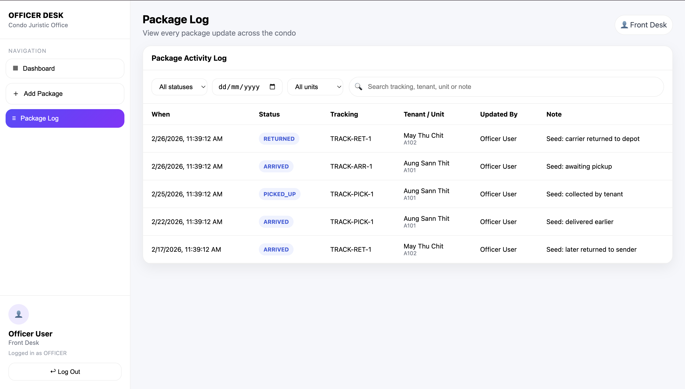

---

## ⚙️ 3. Administrator Panel
The Admin role provides high-level oversight and management tools to maintain the building's infrastructure, user accounts, and package security.

### 🔑 Key Features
* **System-Wide Dashboard:** Monitor live operational status, total active officers, tenant counts, and daily package movement statistics.
* **User & Role Management:** Full administrative control to create, edit, or remove accounts for both Staff/Officers and Tenants.
* **Infrastructure Configuration:** Manage building data and specific room/unit details, including floor levels and availability status.
* **Master Package Records:** Access a global list of all packages in the system with the ability to view individual details or remove records.
* **Full Audit Log:** A comprehensive, searchable log of every package status change ever made in the system, ensuring complete accountability.

### 📸 Administrator Interface
**Admin Dashboard**
A bird's-eye view of all system activity and operational status.
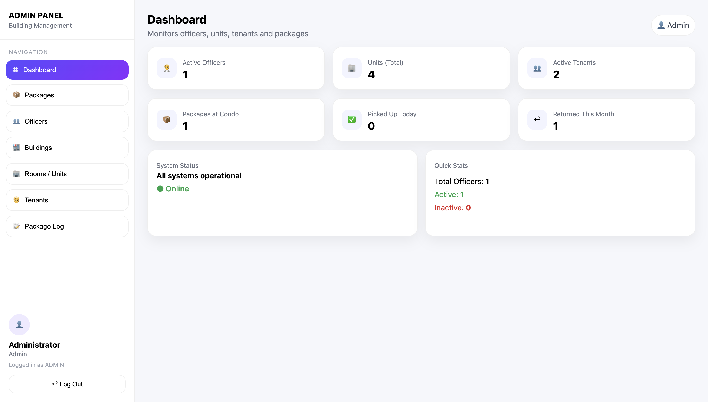

**Infrastructure & User Management**
Configure the physical layout of the condo and manage the accounts for residents and staff.
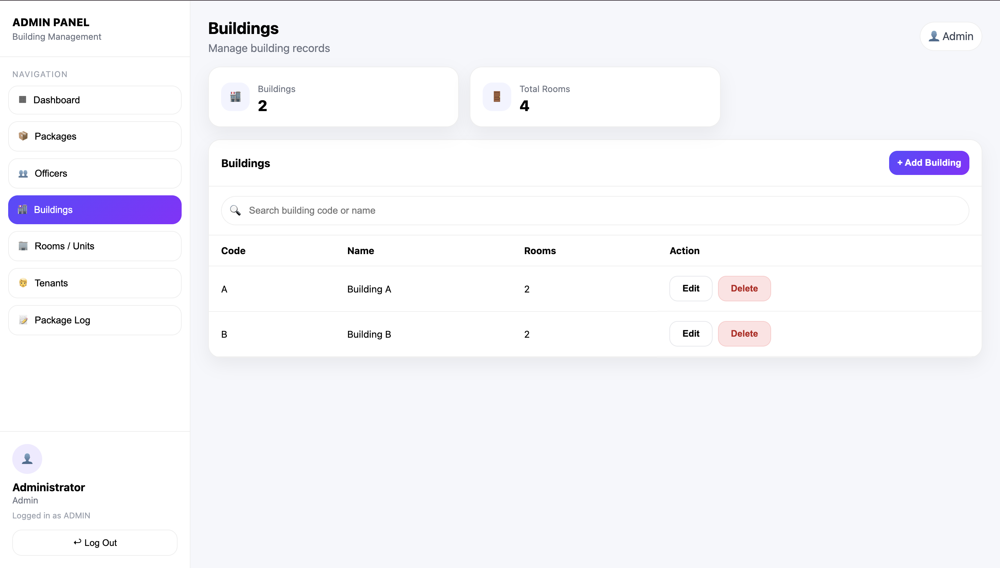
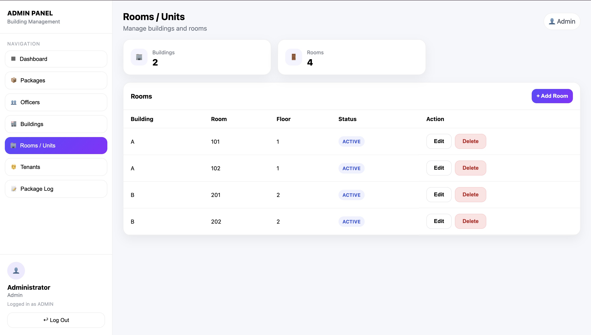
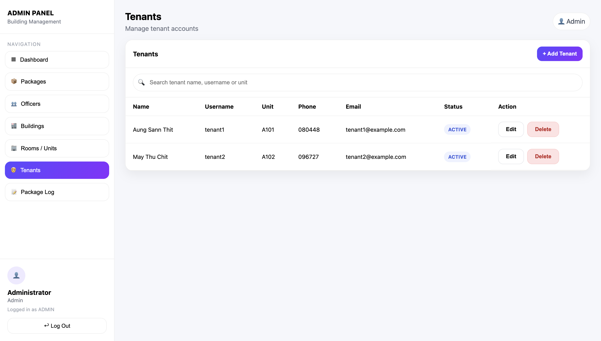
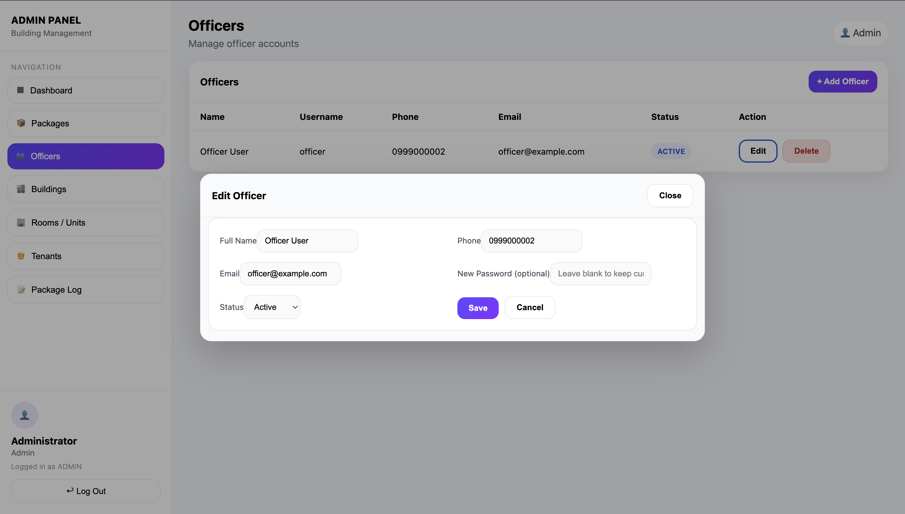

**Package Governance & Detailed Audit**
Review master lists and drill down into specific package records and historical status logs.
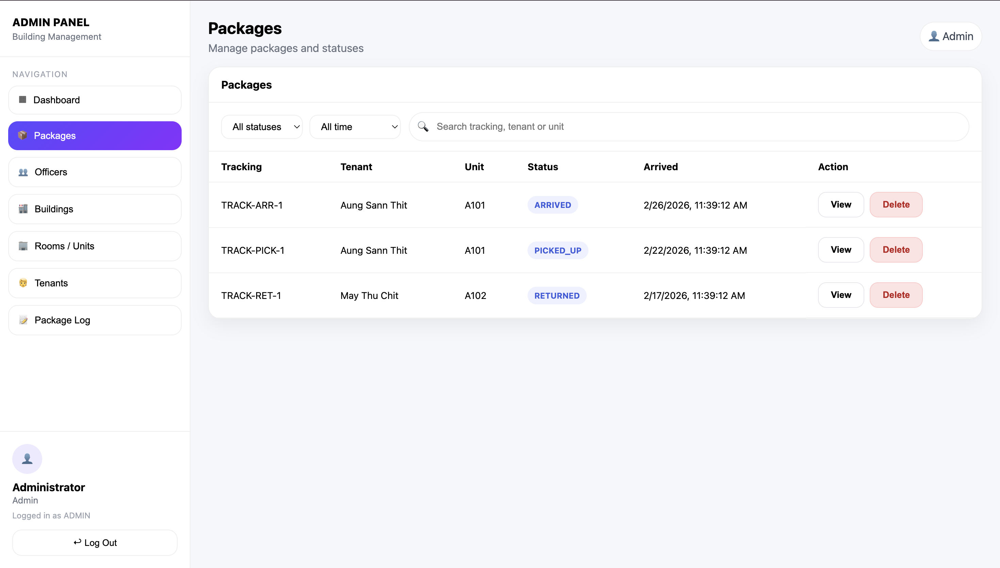
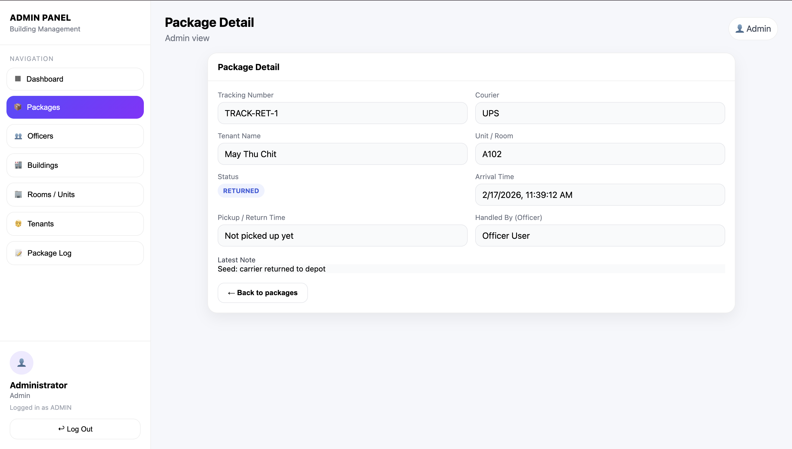
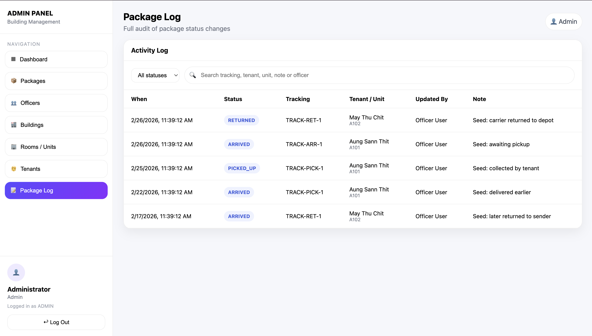

---
